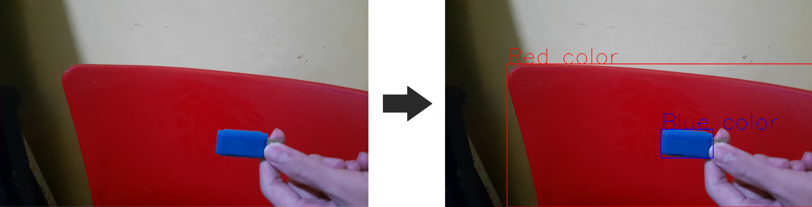
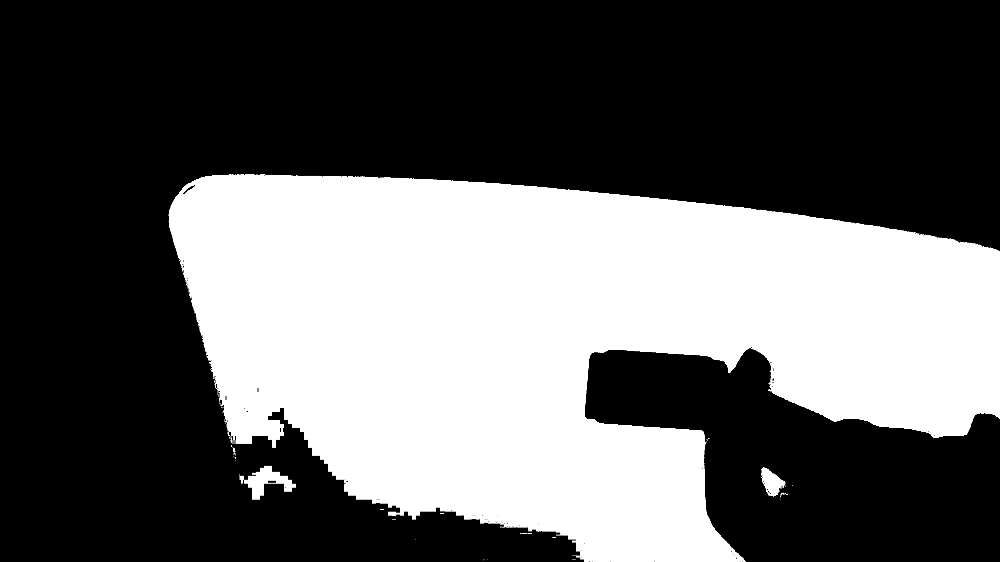
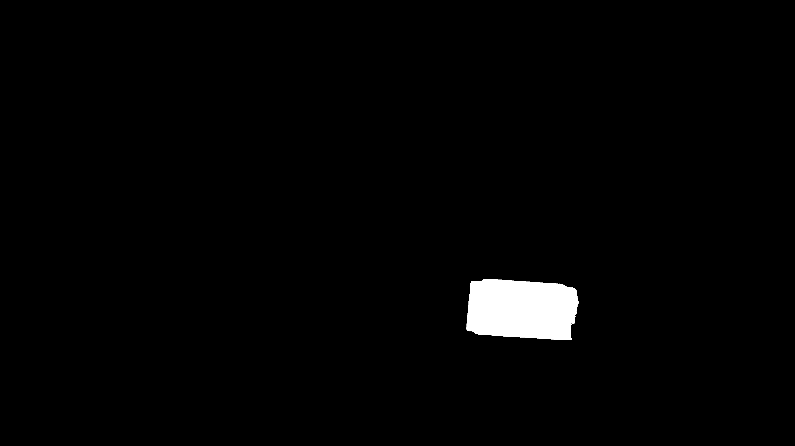
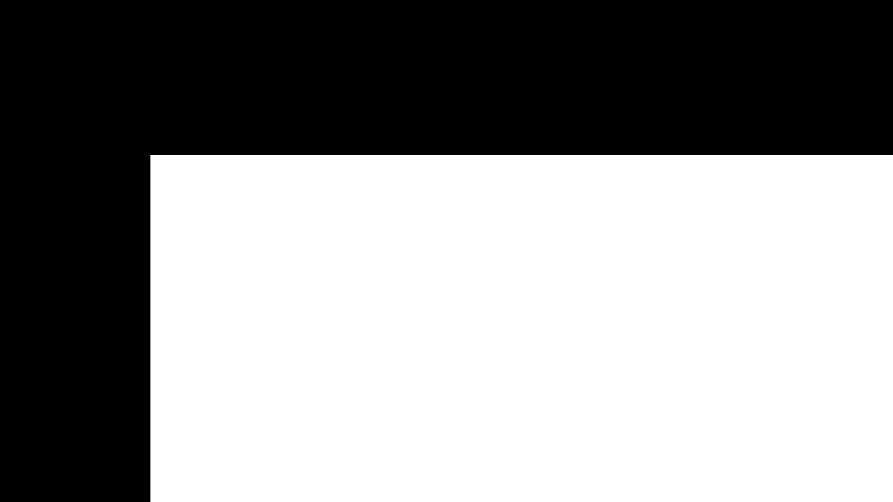
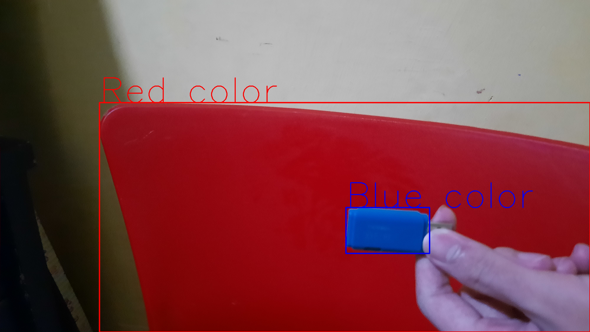

# OpenCV ICHIRO

This repository contains OpenCV image processing tutorials and color detection project

## Description of Files

These are the tutorial files I learned from OpenCV Documentation

| filename                 | description                                                                |
| ------------------------ | :------------------------------------------------------------------------- |
| colorspaces.py           | Detect yellow and orange color and then mask the image from camera         |
| global_thresholding.py   | Apply some thresholding methods to the image                               |
| adaptive_thresholding.py | Apply adaptive thresholding to the image                                   |
| blur.py                  | Blur the image with Averaging and Gaussian blur                            |
| perspective.py           | Transform the image with some input and output points                      |
| edge.py                  | Detect edges in the image with adjustable threshold                        |
| gradients.py             | Find the image gradients and with Laplacian, Sobel X, and Sobel Y filter   |
| rotation.py              | Rotate the image by some degree given the input from the user              |
| template_matching.py     | Find similiar shape based on input image                                   |
| watershed.py             | Label the image's foreground and background with Watershed Algorithm       |
| contours.py              | Find the biggest contour and label it and its parent                       |
| histogram.py             | Display the image's histogram                                              |
| hist_2d.py               | Display the image's histogram, but in 2d                                   |
| equalization.py          | Equalize the histogram of a black and white image to give it more contrast |
| backprojection.py        | Detect parts of an object with histogram of the object of interest         |

## Project Overview

I made a python code to detect objects' colors from the camera, and label them. It will detect the blue object first and then check if there is any red object within the blue object



## How it works

First, it fetches the image from user's camera using `VideoCapure` function from OpenCV. It has fixed blue and red color range. Then, it masks some areas of the image with `inRange` with the range before. Here is the code snippet of this part:

```python
hsv = cv.cvtColor(image, cv.COLOR_BGR2HSV)

lower_red = np.array([170, 100, 100])
upper_red = np.array([180, 255, 255])
red_mask = cv.inRange(hsv, lower_red, upper_red)

lower_blue = np.array([100, 50, 50])
upper_blue = np.array([120, 255, 255])
blue_mask = cv.inRange(hsv, lower_blue, upper_blue)
```

Here is the output of red_mask and blue_mask:




After masking the colors, it creates rectangle shaped mask from the red contours. Here is the code snippet of this part:

```python
red_contour, red_hirearchy = cv.findContours(red_mask, cv.RETR_TREE, cv.CHAIN_APPROX_SIMPLE)

for i, contour in enumerate(red_contour):
  area = cv.contourArea(contour)
  if (area > 400):
    x, y, w, h = cv.boundingRect(contour)
    cv.rectangle(red_mask, (x, y), (x + w, y + h), (255, 255, 255), -1)
```

Here is how the mask looks like:



After obtaining the rectangle mask, it will perform `bitwise_and` operation with `blue_mask` to filter out the blue contours that are not part of red objects. Lastly, it draws blue and red rectangles around the objects.

```python
for i, contour in enumerate(red_contour):
    area = cv.contourArea(contour)
    if (area > 400):
      x, y, w, h = cv.boundingRect(contour)
      cv.rectangle(image, (x, y), (x + w, y + h), (0, 0, 255), 2)
      cv.putText(image, "Red color", (x, y), cv.FONT_HERSHEY_SIMPLEX, 1.5, (0, 0, 255))

for i, contour in enumerate(blue_contour):
  area = cv.contourArea(contour)
  if (area > 400):
    x, y, w, h = cv.boundingRect(contour)
    cv.rectangle(image, (x, y), (x + w, y + h), (255, 0, 0), 2)
    cv.putText(image, "Blue color", (x, y), cv.FONT_HERSHEY_SIMPLEX, 1.5, (255, 0, 0))
```

Here is the final result:


